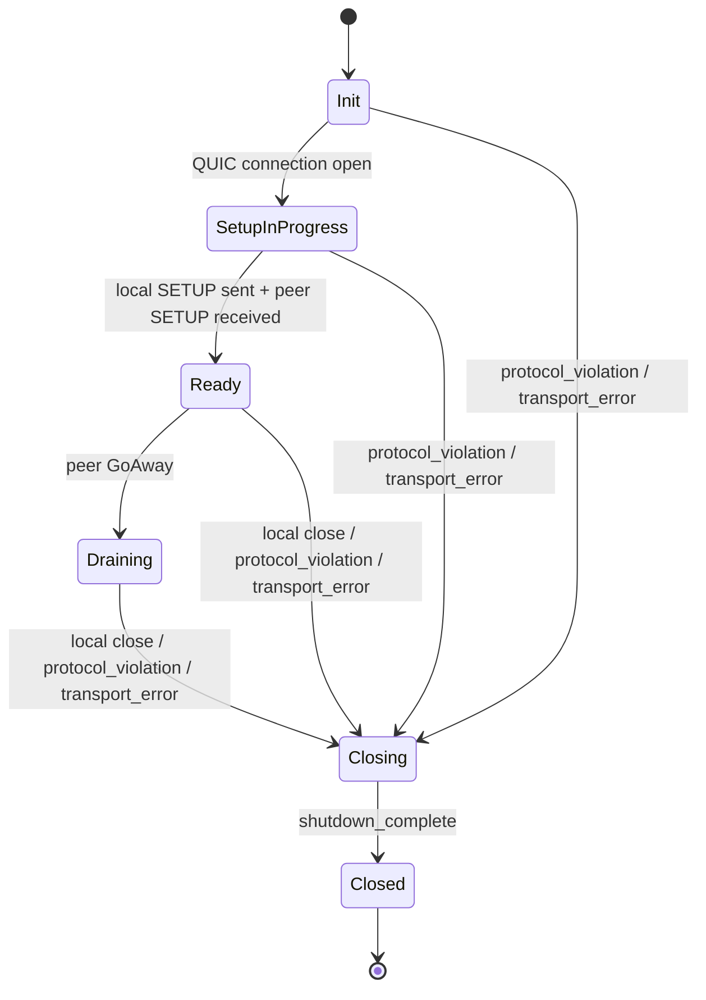
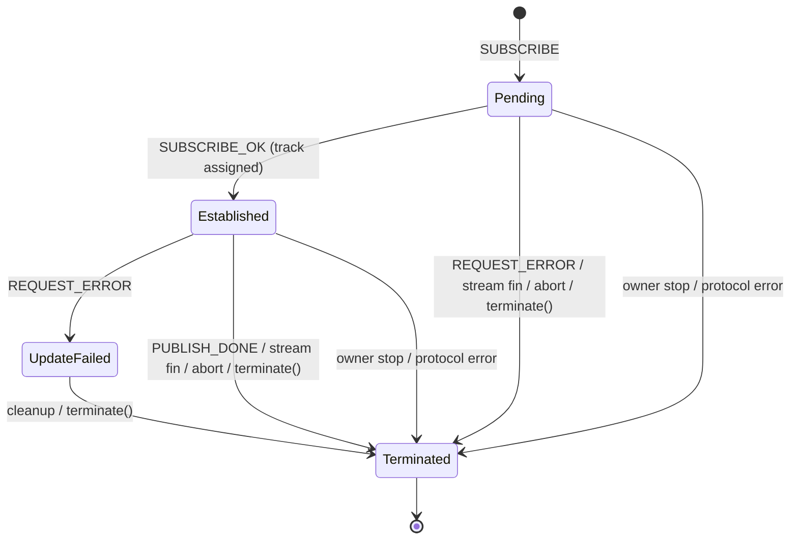

## State Machine Descriptions
Below are state machines implemented in Moqtopus.

Note: I have named class methods to be consistent to the state names in these diagrams as much as possible, but some may differ

### Session-level state

### SUBSCRIBE request stream

You see `REQUEST_ERROR` shows up between Established and UpdateFailed state, with no `REQUEST_UPDATE` in the diagram. Sending `REQUEST_UPDATE` requires the state to be Established, but the transmission itself does not cause a state transition. This is because multiple `REQUEST_UPDATE`s are allowed to be sent in parallel, and projecting each `REQUEST_UPDATE`'s state to the overall stream state will be super complex. Instead, each `REQUEST_UPDATE` is managed as `PendingRequest` type, waiting for either `REQUEST_OK` or `REQUEST_ERROR` to be returned.
